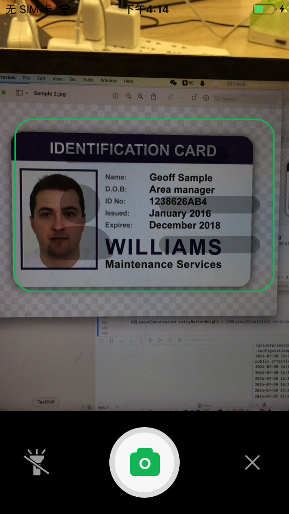
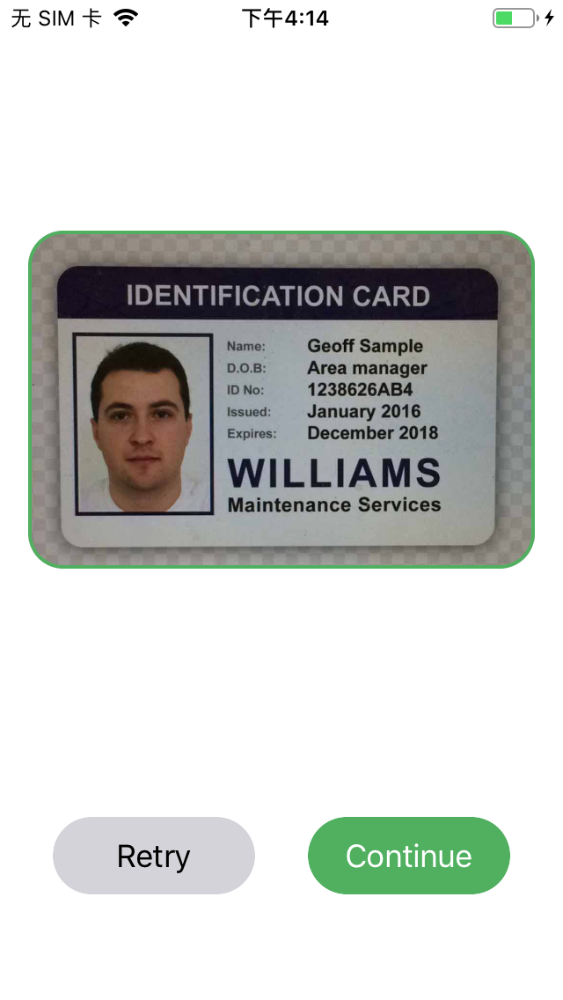
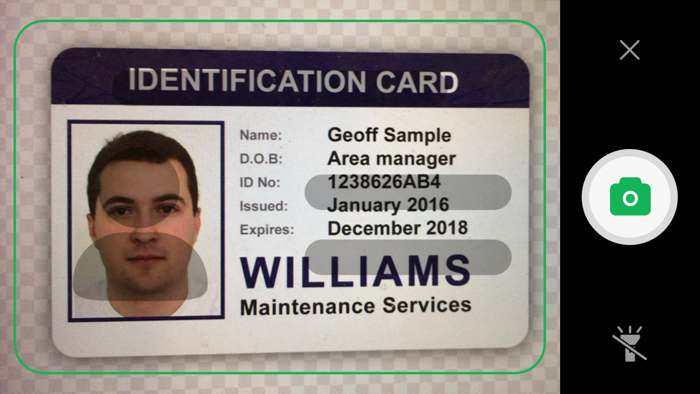
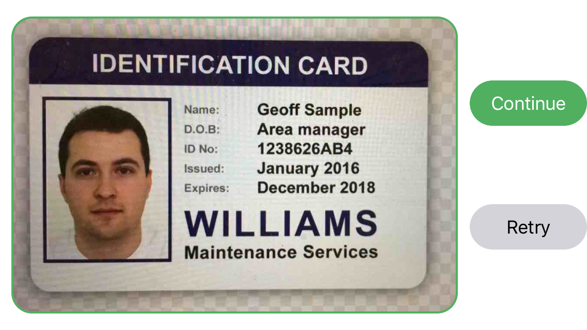

# 简介

TDOcrDocCapture 是为客户提供一个证件拍摄的UI库，以源码形式提供，同时支持iOS 和 Android，本仓库为iOS 仓库

### 竖屏

| 拍照页面 | 裁剪页面 |
| -------- | -------- |
|   |   |

### 横屏

| 拍照页面 | 裁剪页面 |
| -------- | -------- |
|    |   |


# 集成

1.将 TDOcrDocCapture/TDOcrDocCapture 文件夹下 TDOcrDocCapture UI库的源代码文件，拖入您的xcode 工程；

2.在需要的地方调用

2.1.引入头文件

```
#import "TDOcrDocCaptureViewController.h"
```

2.2.调用

```
- (void)initRootVC {
    self.window = [[UIWindow alloc] initWithFrame:[UIScreen mainScreen].bounds];
    TDOcrDocCaptureViewController * captureVC = [[TDOcrDocCaptureViewController alloc]init];
    self.window.rootViewController = captureVC;
    [self.window makeKeyAndVisible];
}

- (BOOL)application:(UIApplication *)application didFinishLaunchingWithOptions:(NSDictionary *)launchOptions {
    [self initRootVC];
    return YES;
}
```


# 配置项

在 TDOcrDocCaptureViewController.m 的顶部

## 1.实际裁剪相对裁剪框尺寸的比率

#define CROPRATIO  1.1

默认是 1.1，可以修改为你需要的大小


## 2.裁剪后证件图片的期望大小

#define TARGET_IMAGE_KB 300

默认是300Kb，可修改为你期望的大小
